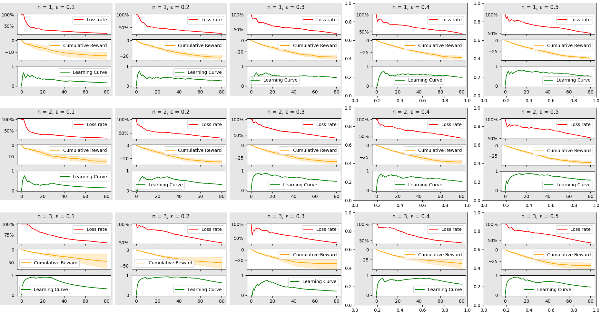

# Learning Tic-Tac-Toe Using N-Step Q-Learning
[](https://github.com/frederikgram/nstep_qlearning_tictactoe/blob/master/LICENSE)
[](https://github.com/frederikgram/hyper/actions?query=workflow%3ADependency+Review)
[]()


Reinforcement learning (RL) is an area of machine learning concerned with how intelligent agents ought to take actions in an environment in order to maximize the notion of cumulative reward. Reinforcement learning is one of three basic machine learning paradigms, alongside supervised learning and unsupervised learning. In this project, we implement a reinforcement learning algorithm called Q-learning, to train an agent to play Tic-Tac-Toe.

The agent will be trained using a technique called Q-learning, which is a model-free reinforcement learning algorithm. Q-learning is an off-policy TD control algorithm. It can be used when the MDP is known, and produces optimal policies given infinite exploration time and a stationary environment.

This implementation utilizes the N-step Q-learning algorithm, which is an extension of the standard Q-learning algorithm. N-Step in the context of Tic-Tac-Toe means that the agent will learn from the outcome of the game after N moves, and not after the completion of a game. This is done to reduce the amount of time it takes for the agent to learn the optimal policy.

The purpose of this application is to assist in the analysis of agent performance over a set of hyperparameters. The following graph showcases each configuration of hyperparameters as a block with three graphs, and will automatically adjust to any number of configurations given to the application.

## Example

    $ python3 qlearning.py --episodes 80 --epsilons 0.1 0.2 0.3 0.4 0.5 --nsteps 1 2 3 --opponent minimax --debug --plot



## Usage

### Requirements
    $ pip install -r requirements.txt


### Arguments
:speech_balloon: both `--epsilon` and `--nsteps` can be formatted as lists like so `--epsilons 0.1 0.2 0.3 --nsteps 1 2 3`
```
usage: qlearning.py [-h] --episodes EPISODES --epsilons EPSILONS [EPSILONS ...] --nsteps NSTEPS [NSTEPS ...]
                    [--gamma GAMMA] [--alpha ALPHA] [--repetitions REPETITIONS] [--opponent OPPONENT] [--size SIZE]
                    [--debug] [--nolerp] [--output OUTPUT] [--save-models] [--save-metrics] [--plot]

Train a Q-Learning agent to play Tic-Tac-Toe.

optional arguments:
  -h, --help            show this help message and exit
  --episodes EPISODES   Number of episodes to train for.
  --epsilons EPSILONS [EPSILONS ...]
                        Epsilon value(s) to train for.
  --nsteps NSTEPS [NSTEPS ...]
                        Number of steps to look ahead increasing from 1 to n.
  --gamma GAMMA         Gamma value(s) to train for.
  --alpha ALPHA         Alpha value(s) to train for.
  --repetitions REPETITIONS
                        Number of times to repeat each combination of hyperparameters.
  --opponent OPPONENT   The opponent to play against, either 'random' or 'minimax'.
  --size SIZE           The size of the board, default is 3x3.
  --debug               Print the board after each step.
  --nolerp              Don't Linearly interpolate epsilon over the number of episodes.
  --output OUTPUT       Path
  --save-models         Save the models after training.
  --save-metrics        Save the metrics after training.
  --plot                Plot the metrics after training.
```

### Example Runtime
    $ python3 qlearning.py --episodes 80 --epsilons 0.1 0.2 0.3 0.4 0.5 --nsteps 1 2 3 --debug --plot

### Conditional Outputs

If `--output` is not specified, the output will be saved in the `.` directory.


If `--save-models` is specified, the q-tables will be saved as pickle files to the output directory.


If `--save-metrics` is specified, the metrics will be saved as pickle file representing a dictionary to the output directory.

If `--plot` is specified, the metrics will be plotted and shown using matplotlib, from which you can save the plot manually.
